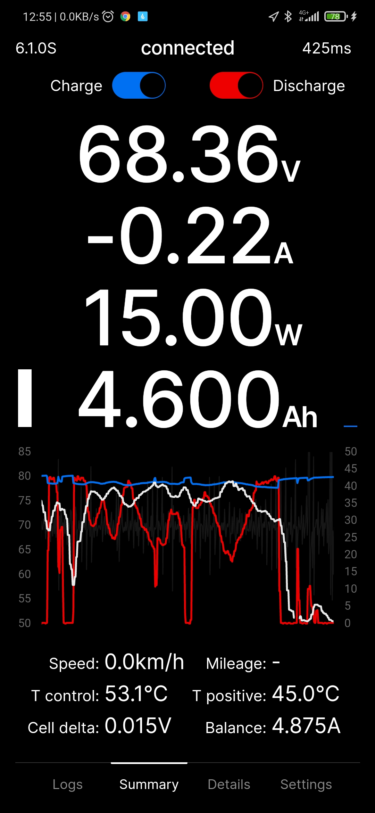
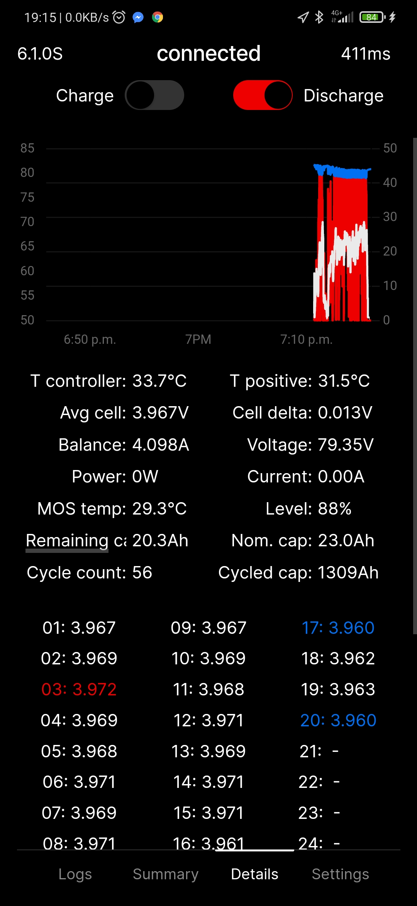
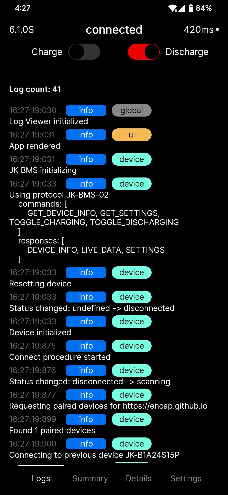

# [Better BMS App](https://encap.github.io/better-bms-app/)
#### Add it to the homescreen for the best experience!

Web app for managing Battery Management Systems (BMS) via Bluetooth with live data visualization. Currently, it only supports my own JK-BMS, but additional protocols and devices can be added easily using strictly-typed config files in `src/devices`. I have been using this app for a year without many issues on my high-power e-bike. I also added additional features for vehicles. This project is built from scratch by reverse-engineering the protocol used by the original app, partial Chinese documentation, and other [community projects](#references).

NOTE: I'm not responsible for bricked devices, explosions, and fires. Use at your own risk, especially when using write commands.
Android/Chrome freezes occasionally. This is due to corrupted packets from the BMS.
Also, the BMS itself sometimes stops responding (rarely, don't panic), but it does come back after a while without any intervention.
If you see ping below 10ms (should be 300-1000ms), please reconnect the device. It's a bug in the Browser/Android when it queues the packets.

## Screenshots

<p float="left">
  
  
  
</p>


# Installation and usage
1. Make sure you have `Node >=16` installed and `yarn` package manager.
2. Install dependecies
    ```sh
    yarn install
    ```
3. Fire up dev server
    ```sh
    yarn start
    ```
4. Make sure to turn on bluetooth, allow permissions and enable this browser flags:
    - [Experimental web platform features](chrome://flags/#enable-experimental-web-platform-features)
    - [Web Bluetooth API](chrome://flags/#enable-web-bluetooth)
    - [Bluetooth new permissions backend](chrome://flags/#enable-web-bluetooth-new-permissions-backend)

## Motivation
The original app was freezing and crashing when switching to other apps (e.g., Maps) while riding my bike. The password prompt was annoying when riding with gloves. Scraping data from the screen or connecting with Tasker was unreliable.
Modifying the Qt 5 APK was difficult since it's a compiled .so library, and messing up offsets was a concern. However, I managed to bypass the password and change some colors.
As a front-end developer, I realized that with the Bluetooth API now supported in browsers, making my own app in React should be possible!

## Features and Roadmap
- :white_check_mark: Proof-of-concept using Web Bluetooth API
- :white_check_mark: Protocol reverse-enginnering
- :white_check_mark: Protocol and device-agnostic implementation
- :white_check_mark: OLED friendly GUI
- :white_check_mark: Animated bar indicators, left (white) for state-of-charge and right for power
- :white_check_mark: Completelely offline PWA app.
- :white_check_mark: Public Beta release
- :white_check_mark: Live Chart with Current (red), Voltage (blue), Ping (gray)
- :white_check_mark: Current speed from GPS with chart (white)
- :white_check_mark: Mileage (wh/km) and range estimation
- :white_check_mark: Charge and Discharge toggle control :warning:
- Rest of settings (for now use original app)
- Themes
- BMS mock (to not brick the real one during development)
- Notifications
- History

## References
- https://github.com/syssi/esphome-jk-bms - ESPHome component [RS485 BLE, rw] (C++, Python)
- https://github.com/PurpleAlien/jk-bms_grafana - Read data and graph in Grafana [RS485, ro] (Python)
- https://github.com/jblance/jkbms - Read data, used in jblance/mpp-solar [BLE, ro] (Python)
- https://github.com/sshoecraft/jktool - Linux utility [RS485 CAN BLE, ro] (C)
- https://github.com/maxx-ukoo/jk-bms2pylontech - Pylontech low voltage US2000 Bridge [RS485, ro] (C)
- https://github.com/ismarintan98/JK_BMS - Simple data monitor [RS485] (C++)
- https://github.com/Louisvdw/dbus-serialbattery/blob/master/etc/dbus-serialbattery/jkbms.py VenusOS drive [RS485, ro] (Python)

